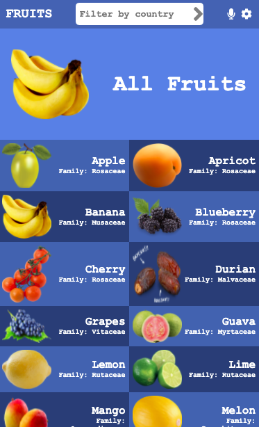
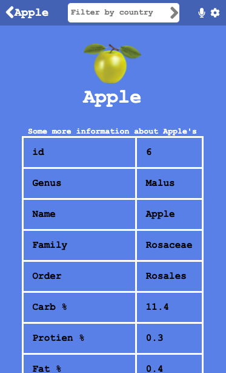

# Book Store App

> A Fruit Information System that picks fruits from a Remote API, allowing Users to get to know various information regarding different fruits.




- A User can click on a particular fruit to see more information regarding the fruit.

## Built With

- JSX, CSS
- React, Redux

## Live Demo

- [Netlify](https://fruitify-react-redux.netlify.app/)

## Video Walkthrough

- [Loom Video](https://www.loom.com/share/0a4e991e652f4944ab1a48214daa5350)

# Set Up
## Clone This Repository
```
$ git clone https://github.com/emmyobonyo/Fruit-Information-System.git
$ cd Fruit-Information-System
```

## Run Project
```
$ npm install
$ git checkout development
$ npm start
```

👤 **Emmanuel Obonyo**

- GitHub: [@emmyobonyo](https://github.com/emmyobonyo)
- Twitter: [@emmyobonyo](https://twitter.com/emmyobonyo)
- LinkedIn: [Emmanuel Obonyo](https://www.linkedin.com/in/emmanuel-obonyo-3728a2200/)
## 🤝 Contributing

Contributions, issues, and feature requests are welcome!

Feel free to check the [issues page](https://github.com/emmyobonyo/Fruit-Information-System/issues).

## Appreciation

Grateful to [Nelson Sakwa](https://www.behance.net/gallery/31579789/Ballhead-App-(Free-PSDs)) for the design inspiration.

Thanful for [Fruity Vice](https://www.fruityvice.com/api/fruit/all) for providing the API.

## Show your support

Give a ⭐️ if you like this project!
